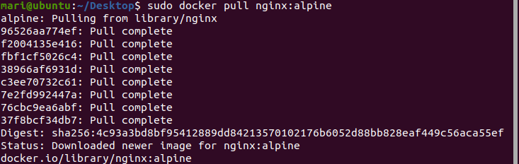
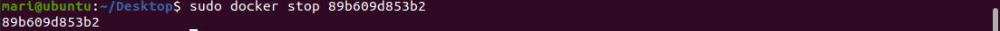

## Create a SSH key on the local computer
1. Creation of folder SSH_keys


## Create a SSH key on the local computer
2. After opening GitBash terminal was used the following commands.
```
ssh-keygen -t ed25519 -C "7503234@stud.nau.edu.ua"
Generating public/private ed25519 key pair.
Enter file in which to save the key (/c/Users/User/.ssh/id_ed25519): csa_mari_petrovska_nau
```


This will create two files, a private key `csa_mari_petrovska_nau` and public key `csa_mari_petrovska_nau.pub`, in the current directory.

## Register the key in Git `config` file


```
Host github.com
  HostName github.com
  User git
  IdentityFile ~/.ssh/csa_mari_petrovska_nau
  IdentitiesOnly yes
```

## Add the public key to the Github account

```
clip < csa_mari_petrovska_nau.pub
```


In a web browser, go to your github account https://github.com/cybersecurityacademy > Settings > SSH and GPG keys > SSH Keys > New SSH Key.

In the Key field, paste (Ctrl+V) the content of the public key copied previously. It should look like below:


After was added a SSH key:


## Checking authentication work
Write the command `ssh -T git@github.com`


## Register your user details
This will show the user name of each commit in Github.
```
git config --global user.email 7503234@stud.nau.edu.ua
git config --global user.name MariPetrovska
```
To see all installed settings and find out that they are, use the command: 
`git config --list`


## Clone a repository
```
cd /c/Users/User/Documents
git clone git@github.com:cybersecurityacademy/CSA2023-Ukraine.git
```


Creation of folder Lab_1


## Docker

1. To check whether Docker is running in Ubuntu use the command `sudo service docker status`:


2. To see the images in Docker use the command `sudo docker images`:
   


3. To create an image use the command `sudo docker pull name:tag`:
   


4. To publish a container's port to the host, create the port binding using flag  `-p` in the command `sudo docker -d -p 80:80 nginx:alpine`:
   


> **Note**
> Standard to use the same port on your host as a container using.

After we write the localhost:


And at the result have the following:


5. As container is a running instance of an image, to create a container use the command `sudo docker run name:tag`:
   


To check `only` running containers use the command `sudo docker ps`:


And if it's needed to use `running and stopped` list of containers use the command `sudo docker ps -a`:


To stop work of container use the command `sudo docker stop container_id`:



And check the results:


